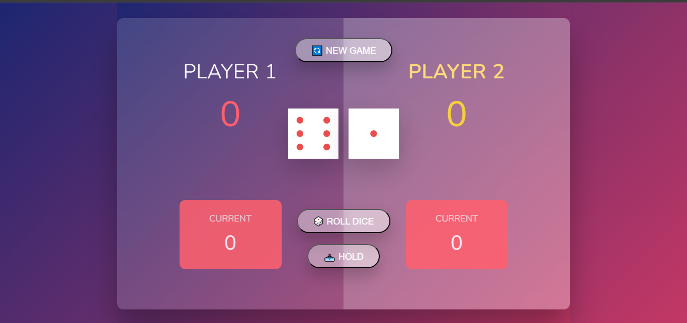

# 🎲 Pick Game – A Two-Player Dice Game

 

## 🚀 Overview

Pick Game is a **two-player dice game** where players take turns rolling **two dice** to reach **100 points first**! 🎲 

**But watch out!** If you roll a **1 on either dice**, you lose your turn. If you roll **double 1s**, you lose all points!

Built with **React & Styled Components**, the game features:
✅ **Beautiful UI** with a **modern gradient background**  
✅ **Exciting interactions** (button effects, winning highlights)  

---

## 🛠 Tech Stack

- **React.js** ⚛️ (For dynamic UI)
- **Styled Components** 💅 (For scoped, dynamic styling)
- **JavaScript ES6+** 🚀 (For game logic)

---

## 🚀 Installation & Setup

1️⃣ **Clone the repository**  
```sh
git clone https://github.com/Jawid-7ce/react-pick-game
cd pick-game
